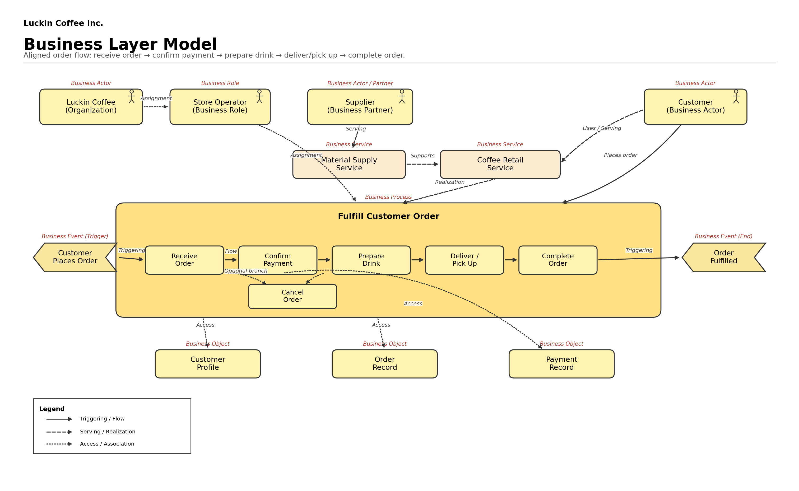
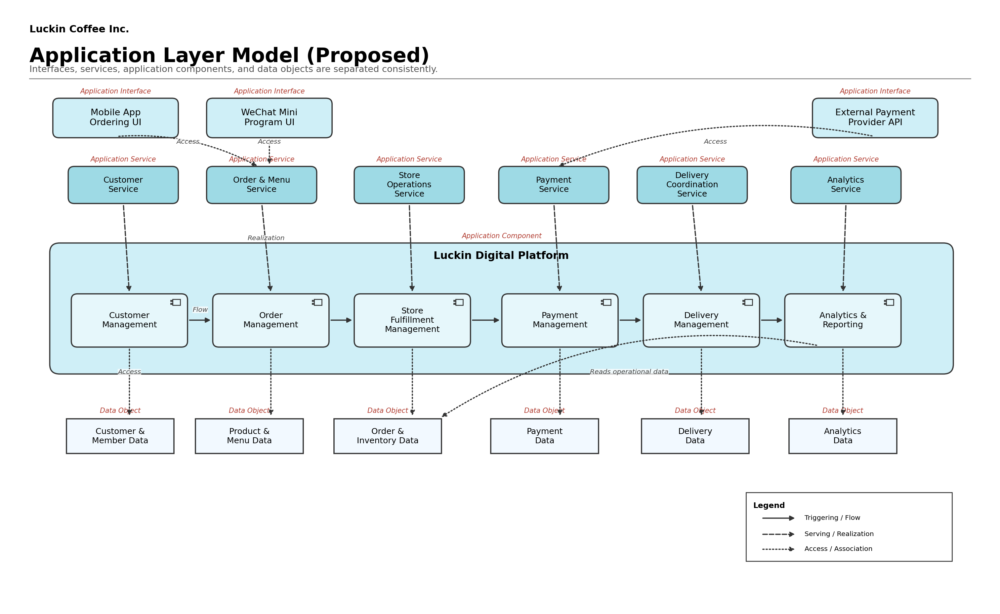
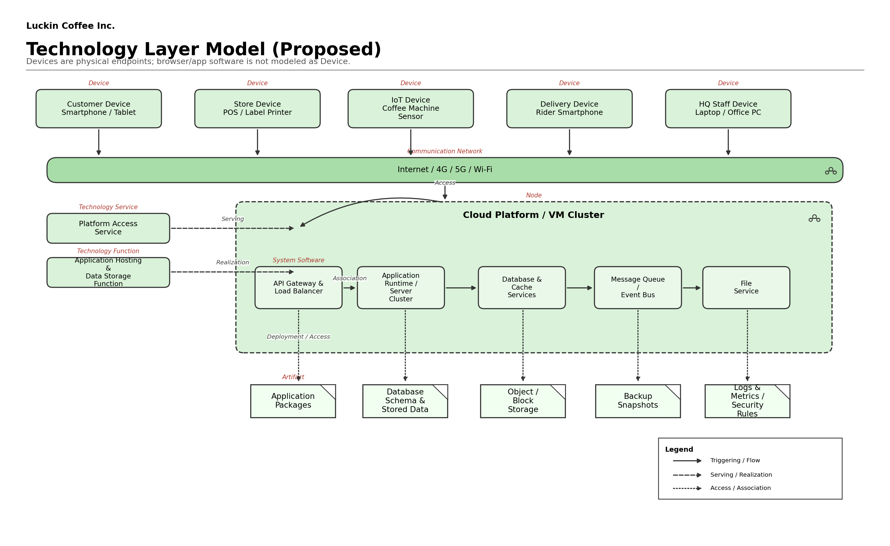

# Seminar 6: Luckin Coffee — Database Modeling & Normalization

> **Course**: Enterprise Architecture and Database Programming (IK2015)
> **Instructor**: Lawrence Henriquez
> **Group**: Group 4 — Krust, Sean, Nosta, Evan, Foreve
> **Date**: Week 8

---

## Task Overview

This seminar continues the ER modeling and normalization work begun in Seminar 5. The final project report includes:

- Conceptual and Logical ER Diagrams
- Data Dictionary
- Normalization (to Third Normal Form)
- Sample Data
- Relational Schema (from ER Diagrams)

---

## Appendix A: Enterprise Architecture Models

### A.1 Business Layer Model (BLM)



**Purpose**: Describes the business architecture — actors, roles, services, processes, and events

**Business Actors & Roles**:
| Element | Type | Description |
|---------|------|-------------|
| Luckin Coffee | Organization | The enterprise itself |
| Store Operator | Business Role | Manages store operations |
| Supplier | Business Actor / Partner | Provides raw materials, equipment, recipes, etc. |
| Customer | Business Actor | Places orders, receives products |

**Business Service**:
- **Coffee Retail Service** — the core service offered by Luckin to customers

**Business Process: Fulfill Customer Order**:

```
Customer Places Order (Trigger)
        │
        ▼
┌─────────────────┐
│  Receive Order   │ ← Business Process
└────────┬────────┘
         │
         ▼
┌─────────────────┐
│ Confirm Payment │ ← Business Process
└────────┬────────┘
         │
         ▼
┌─────────────────┐
│  Prepare Drink   │ ← Business Process
└────────┬────────┘
         │
         ▼
┌─────────────────────────┐
│  Deliver or Pick Up      │ ← Business Process
└────────┬────────────────┘
         │
         ▼
┌─────────────────┐
│ Complete Order   │ ← Business Process
└────────┬────────┘
         │
         ▼
   Order Fulfilled (End)
```

**Business Objects**:
- Customer Profile — accessed by Customer actor

**Relationships Shown**:
- Association: Luckin Coffee ↔ Store Operator
- Assignment: Supplier ↔ Coffee Retail Service
- Access: Customer → Customer Profile
- Triggering: Customer Places Order → Receive Order
- Flow: Between process steps

---

### A.2 Application Layer Model (ALM)



**Purpose**: Describes the application architecture — services, components, and data objects

**Application Services** (Exposed to External Users):

| Service | Channel | Description |
|---------|---------|-------------|
| Mobile App | iOS / Android | Primary customer-facing application |
| WeChat Mini Program | Mini Program | Alternative ordering channel |
| Order & Menu Service | Application Service | Manages orders and menu |
| Store Operations Service | Application Service | Manages store operations |
| Delivery Coordination Service | Application Service | Coordinates delivery |
| Payment Service | Application Service | Processes payments |

**Application Components** (Luckin Digital Platform):

```
┌─────────────────────────────────────────────────────────────────────┐
│                   Luckin Digital Platform                            │
│  ┌──────────────┬──────────────┬──────────────┬──────────────┐     │
│  │   Customer    │    Order     │    Store     │   Delivery   │     │
│  │  Management   │  Management  │ Fulfillment  │  Management  │     │
│  │              │              │  Management  │              │     │
│  └──────────────┴──────────────┴──────────────┴──────────────┘     │
│  ┌──────────────┬──────────────────────────────────────────────┐   │
│  │   Payment     │        Analytics & Reporting                 │   │
│  │  Management   │                                              │   │
│  └──────────────┴──────────────────────────────────────────────┘   │
└─────────────────────────────────────────────────────────────────────┘
```

**Data Objects**:

| Data Object | Description |
|-------------|-------------|
| Customer & Member Data | Customer profiles, membership levels |
| Product & Menu Data | Menu items, categories, pricing |
| Order & Inventory Data | Orders, inventory levels |
| Delivery Data | Delivery tracking, status |
| Payment Data | Transactions, payment methods |
| Analytics Data | Business intelligence, reports |

**Flow Relationships**:
- Mobile App → Customer Management
- WeChat Mini Program → Customer Management
- Order & Menu Service → Order Management
- Store Operations Service → Store Fulfillment Management
- Delivery Coordination Service → Delivery Management
- Payment Service → Payment Management

---

### A.3 Technology Layer Model (TLM)



**Purpose**: Describes the technology infrastructure — devices, networks, platforms, and software

> The Technology Layer Model is a proposed / assumed deployment architecture based on Luckin Coffee's digital retail business model. It is not a confirmed disclosure of Luckin Coffee's internal production infrastructure.

**Device Layer**:

| Device | Type | User |
|--------|------|------|
| Client Devices | Smartphone/Tablet | Customer / Store |
| Office PC / Laptop | Web Browser Interface | Admin / Internal |
| Store Devices | POS, Label Printer | Store Staff |
| IoT Devices | Coffee Machine Sensors | Store Equipment |
| Rider Smartphone | Rider App Interface | Delivery Staff |

**Communication Network**:
- Internet / 4G / 5G / Wi-Fi

**Technology Platform**:
- **Cloud Platform** — proposed hosting environment for application services

**Platform Access Interface**:
- Entry point for all devices to access cloud services

**System Software**:

| Component | Function |
|-----------|----------|
| Application Hosting & Orchestration | Container or VM-based hosting, deployment, scaling |
| API Gateway (Load Balancer) | Routes requests, balances load |
| Application Servers (Business Logic) | Runs business logic |
| Data Services (DBMS/Cache/Files) | Database, optional caching, file storage |
| Message Queue (Async Event Bus) | Asynchronous messaging |
| File Services | File storage and retrieval |

**Technology Artifacts**:

| Artifact | Technology |
|----------|------------|
| Compute | Containers / VMs |
| Database | Relational DB / Optional NoSQL Store |
| Storage | Object / Block |
| Backup & DR | Backup / Replication Strategy |
| Monitoring & Security | Logs / Metrics / Security Gateway |

---

## How the Three Layers Connect

```
┌─────────────────────────────────────────────────────────────┐
│                    BUSINESS LAYER                            │
│ Customer Places Order → Receive → Confirm Pay → Prepare → Complete │
└─────────────────────────────┬───────────────────────────────┘
                              │ triggers
                              ▼
┌─────────────────────────────────────────────────────────────┐
│                   APPLICATION LAYER                          │
│  Mobile App / Mini Program → Luckin Digital Platform        │
│  (Customer, Order, Store, Delivery, Payment, Analytics)     │
└─────────────────────────────┬───────────────────────────────┘
                              │ runs on
                              ▼
┌─────────────────────────────────────────────────────────────┐
│                   TECHNOLOGY LAYER                           │
│  Devices → Network → Cloud Platform → System Software       │
│  (Compute: Containers/VMs, DB: Relational/NoSQL, Storage)   │
└─────────────────────────────────────────────────────────────┘
```

**Key Mappings to Database Design**:

| Business Concept | Application Component | Technology Artifact |
|------------------|----------------------|---------------------|
| Customer Profile | Customer Management | Customer & Member Data |
| Order Process | Order Management | Order & Inventory Data |
| Store Operations | Store Fulfillment Management | Store data |
| Delivery Tracking | Delivery Management | Delivery Data |
| Payment Processing | Payment Management | Payment Data |
| Business Reports | Analytics & Reporting | Analytics Data / Files |

---

## Appendix B: ER Diagrams & Normalization

*(To be completed based on Seminar 5 initial ER design)*

### B.1 Conceptual ER Diagram

### B.2 Logical ER Diagram

### B.3 Normalization (UNF → 1NF → 2NF → 3NF)

### B.4 Data Dictionary

### B.5 Sample Data

### B.6 Relational Schema

---

## References

- Seminar 6 PDF: Database Modeling, Normalization, and Project Overview
- Seminar 5 materials: Initial ER schema and relational model design
- Previous seminar reports: BSC, BMC, process models, use cases
- ArchiMate notation for layered architecture diagrams
